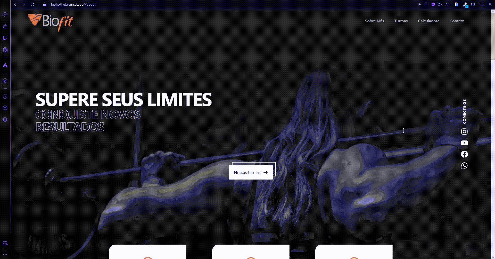
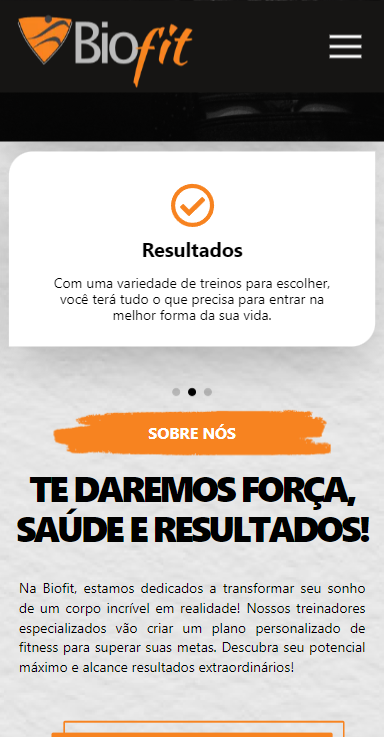
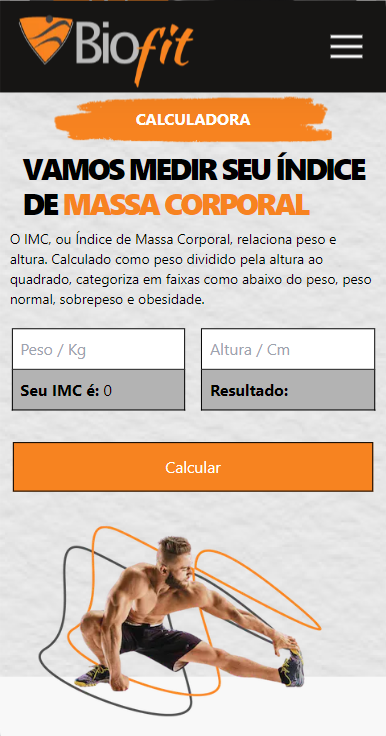

# BioFit Academia - Landing Page

- [Link do projeto](https://biofit-theta.vercel.app)

Essa é uma landing page da Academia BioFit, um projeto desenvolvido com Next.js, TailwindCSS e TypeScript.

## Capturas de Tela

 
<strong>Desktop</strong>

  
  
   
  <strong>Mobile</strong>

## Tecnologias Utilizadas

- **Next.js:** Framework React para renderização do lado do servidor.
- **Tailwind CSS:** Um utilitário de primeiro plano para estilização de componentes.
- **Typescript:** Uma linguagem de programação que adiciona tipagem estática ao JavaScript.